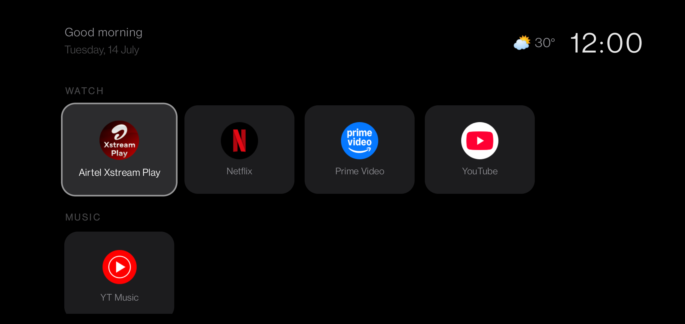
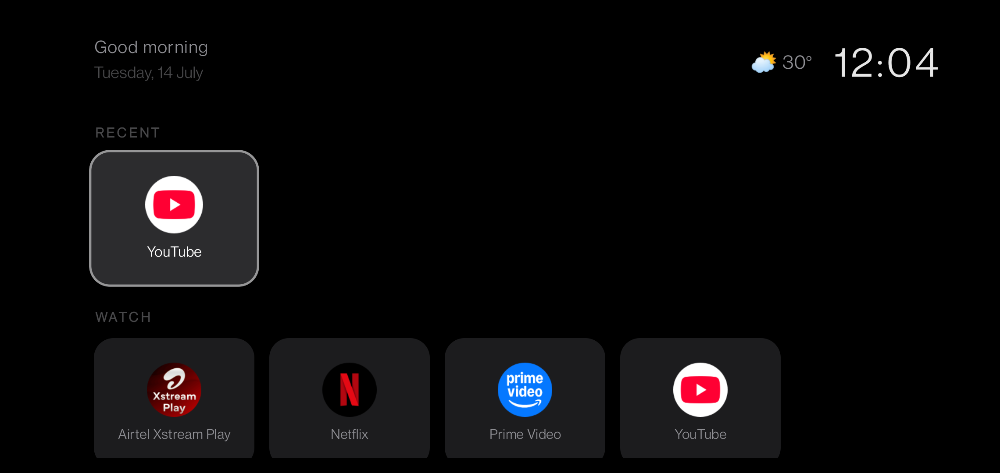
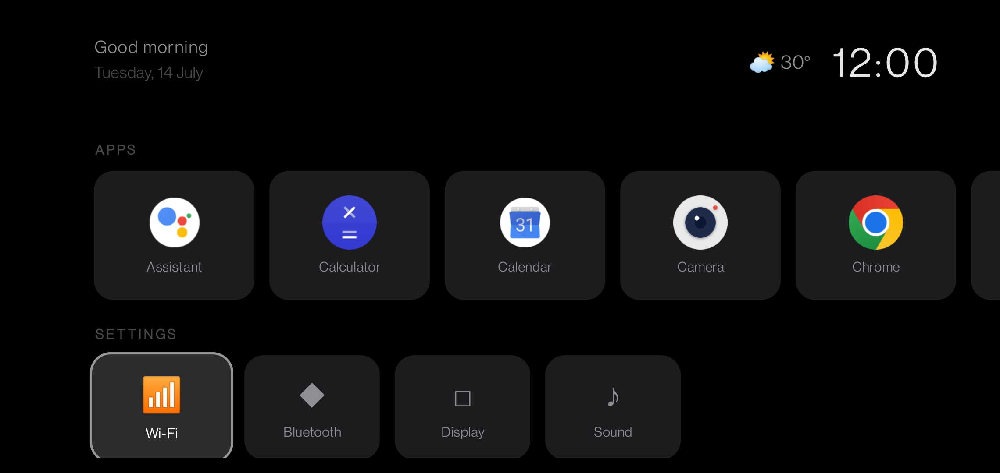
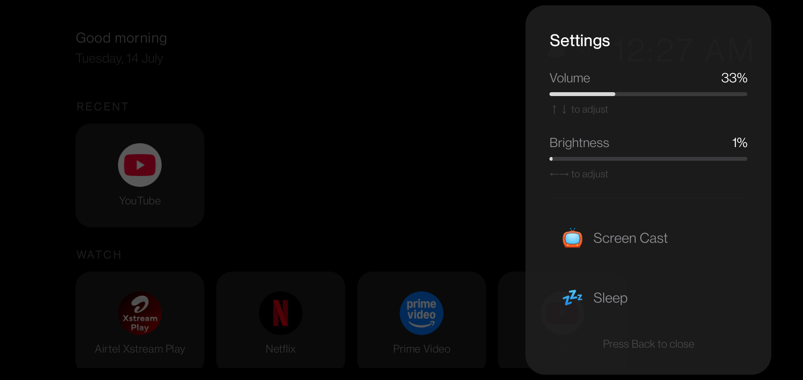
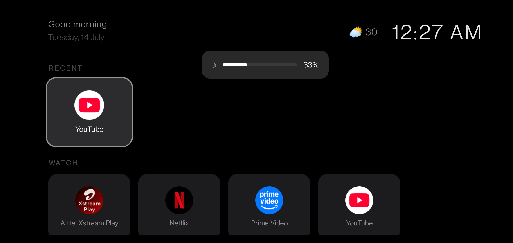

<p align="center">
  
</p>

<h1 align="center">MomTV</h1>

<p align="center">
  <strong>Turn any old Android phone into a smart TV for your family.</strong>
  <br>
  A minimal, Apple-inspired launcher built with Kotlin + Jetpack Compose.
  <br>
  Zero ads. Zero tracking. Zero configuration.
</p>

<p align="center">
  
  
  
  
</p>

---

## Why

Old phones collect dust. Monitors are cheap. Your mom just wants to watch YouTube and Netflix without navigating a complex UI.

MomTV turns any Android phone into a dedicated smart TV appliance:
- Connect the phone to a monitor via **Chromecast** or **USB-C to HDMI** (if supported)
- Pair a **Bluetooth air remote** for D-pad navigation
- Set MomTV as the default launcher — it auto-starts on boot

Mom sees her apps, presses a button, and watches. That's it.

## Screenshots

<table>
  <tr>
    <td><br><sub>Recent + Watch rows with weather</sub></td>
    <td><br><sub>Apps and Settings rows</sub></td>
  </tr>
  <tr>
    <td><br><sub>Quick Settings panel</sub></td>
    <td><br><sub>Custom volume overlay</sub></td>
  </tr>
</table>

## Features

### Core
- D-pad / remote navigation with focus glow animation
- Auto-categorized app rows: **Watch**, **Music**, **Apps**, **Settings**
- **Favorites** row — pin your most-used apps (long-press to add)
- **Recently Opened** row — auto-populated from usage
- **Hide apps** — remove clutter, unhide from settings panel

### Smart TV Experience
- **Custom volume overlay** — replaces Android's default, auto-hides after 2s
- **Quick settings panel** — volume, brightness, Screen Cast, Sleep (press Menu)
- **Weather widget** — live temperature via Open-Meteo (GPS-aware, no API key)
- **Time-based greeting** — "Good morning", "Good afternoon", "Good evening"
- **Photo screensaver** — cycles family photos from gallery with clock overlay
- **OLED burn-in protection** — drifting clock animation on screensaver

### System
- **Auto-launch on boot** — registered as HOME launcher with boot receiver
- **Back key blocked** — launcher never exits accidentally
- **DND mode** — suppresses notifications, restores on exit
- **App auto-categorization** — uses Android's `ApplicationInfo.category` API as fallback
- **Orphan cleanup** — prunes favorites/recents when apps are uninstalled
- **Icon cache** — skips bitmap reload when app list is unchanged

### What It Doesn't Have (By Design)
- No ads, no sponsored content, no telemetry
- No 200-setting configuration screen
- No account required
- No internet dependency (except weather)

## Requirements

| Component | What You Need |
|-----------|---------------|
| **Phone** | Any Android 8.0+ device (tested on OnePlus 6, Samsung S25 Edge) |
| **Display** | Monitor/TV with HDMI input |
| **Connection** | Chromecast, USB-C to HDMI adapter, or Miracast dongle |
| **Remote** | Bluetooth air remote with D-pad (e.g., G20S Pro, WeChip) |
| **Power** | USB-C cable for always-on charging |

## Installation

### From GitHub Releases

```bash
# Download the latest APK from Releases, then:
adb install momtv.apk
```

### Build from Source

```bash
git clone https://github.com/DhilipBinny/SmartTv-MomTv.git
cd SmartTv-MomTv

# Requires JDK 17 and Android SDK
export JAVA_HOME=/path/to/jdk-17
export ANDROID_HOME=/path/to/Android/Sdk

./gradlew assembleDebug

# Install via ADB (USB or wireless)
adb install app/build/outputs/apk/debug/app-debug.apk
```

### Set as Default Launcher

```bash
# Option 1: Via ADB
adb shell cmd role set-role-holder android.app.role.HOME com.binny.smarttv

# Option 2: Via phone settings
# Settings → Apps → Default apps → Home app → MomTV
```

## Remote Control

| Button | Action |
|--------|--------|
| **D-pad arrows** | Navigate between apps |
| **Center / Enter** | Launch app (short press) · Context menu (long press 600ms) |
| **Menu** | Open/close Quick Settings |
| **Volume Up/Down** | Custom volume overlay |
| **Back** | Close overlays (doesn't exit launcher) |
| **Any key** | Dismiss screensaver |

## Tech Stack

- **Language:** Kotlin 1.9
- **UI:** Jetpack Compose + Material 3
- **Architecture:** Single-activity, composable-based
- **Min SDK:** 26 (Android 8.0)
- **Target SDK:** 34 (Android 14)
- **Dependencies:** AndroidX Core, Compose BOM, Lifecycle — no third-party libraries

## Project Structure

```
app/src/main/java/com/binny/smarttv/
├── MainActivity.kt      # Activity lifecycle, key handling, permissions
├── MomTVApp.kt          # All Compose UI — home, grid, overlays, screensaver
├── AppDiscovery.kt      # Package scanning, categorization, launching
├── PrefsManager.kt      # SharedPreferences for favorites, recents, hidden
├── WeatherService.kt    # Open-Meteo API client
├── IconCache.kt         # In-memory bitmap cache
└── BootReceiver.kt      # Auto-start on device boot
```

## Contributing

1. Fork the repo
2. Create a feature branch (`git checkout -b feature/voice-search`)
3. Commit your changes
4. Push and open a Pull Request

## License

MIT License. See [LICENSE](LICENSE) for details.

---

<p align="center">
  Built with care for moms everywhere who just want to watch TV.
</p>
